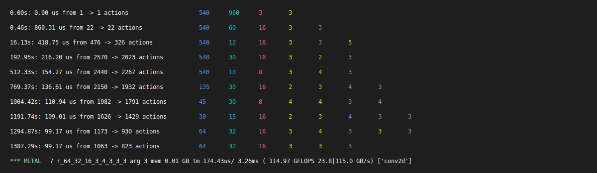

# tinygrad experiments

A collection of small experiments to learn and explore [tinygrad](https://docs.tinygrad.org), a simple deep learning framework.

## Current Experiments

### Canny Edge Detection
An implementation of the Canny edge detection algorithm using tinygrad tensors and operations. This experiment demonstrates:
- Basic tensor operations
- Convolution layers
- Image processing fundamentals
- Gradient computations

## Getting Started

1. Install dependencies:
```bash
uv venv
source .venv/bin/activate.fish
uv pip install -r requirements.txt
```

2. Run the edge detection:
```bash
python edge.py --input your_image.jpg --output-dir output
```

Or try the built-in test image:
```bash
python edge.py --use-test-image --output-dir output
```

## Notes

### Kernel Optimizations

The numbers shown under "globals locals reduce upcast unroll" represent different optimization parameters that tinygrad tries during kernel optimization:



1. <span style="color:#4F94FF; margin-left: 9px;">GLOBALS</span> represents the global/grid-level parallelism.
2. <span style="color:#00CED1; margin-left: 9px;">LOCALS</span> represents thread-level parallelism within a block.
3. <span style="color:#FF6B6B; margin-left: 9px;">REDUCE</span> related to reduction operations, like summing across dimensions.
4. <span style="color:#FFD700; margin-left: 9px;">UPCAST</span> represents how many elements each thread processes at once.
5. <span style="color:#DA70D6; margin-left: 9px;">UNROLL</span> represents loop unrolling factor - how many iterations of a loop are expanded inline.

The sequence shows the beam search trying different combinations of these parameters, gradually improving performance from 216.20 μs to 99.17 μs in the final optimization step. The numbers r_64_32_16_3_4_3_3_3 at the bottom represent the final optimized configuration.
The optimization process starts with larger numbers and gradually refines them through beam search to find the optimal combination that gives the best performance for the specific kernel operation being optimized.

#### BEAM
Beam is the primary search algorithm that is used when setting `BEAM=1` up to `100`. After 100 the search changes to `MCTS` (Monte Carlo Tree Search).
The higher the number the longer the search and probably the better the result.

#### Kernel Code

```C
// Unoptimized Kernel Code

#include <metal_stdlib>
using namespace metal;
kernel void r_64_32_16_3_4_3_3_3(device float* data0, device float* data1, device float* data2, uint3 gid [[threadgroup_position_in_grid]], uint3 lid [[thread_position_in_threadgroup]]) {
  int gidx0 = gid.x; /* 576 */
  int gidx1 = gid.y; /* 32 */
  int gidx2 = gid.z; /* 64 */
  int alu0 = ((gidx0/12)%3);
  int alu1 = (gidx0%3);
  int alu2 = (gidx1<<6);
  int alu3 = (gidx2*8640);
  int alu4 = ((gidx0/36)<<2);
  int alu5 = (alu0*2880);
  int alu6 = ((gidx0/3)&3);
  int alu7 = (alu1*960);
  bool alu8 = ((gidx1<15)&(gidx2<60));
  float acc0 = 0.0f;
  for (int ridx0 = 0; ridx0 < 3; ridx0++) {
    int alu9 = (alu2+alu4+alu6+ridx0);
    for (int ridx1 = 0; ridx1 < 3; ridx1++) {
      int alu10 = ((gidx2*9)+(alu0*3)+alu1+ridx1);
      float val0 = (alu8?*(data2+((ridx1*3)+ridx0)):0.0f);
      float val1 = (((alu9<961)&((alu10<541)&(((alu10<1)!=1)&(((alu9<1)!=1)&alu8))))?*(data1+(alu9+alu3+alu5+alu7+(ridx1*960)+-961)):0.0f);
      acc0 = (acc0+(val1*val0));
    }
  }
  if (alu8) {
    *(data0+(alu2+alu3+alu4+alu5+alu6+alu7)) = acc0;
  }
}
```

```C
// Optimized Kernel Code

#include <metal_stdlib>
using namespace metal;
kernel void r_64_32_16_3_4_3_3_3(device float* data0, device float* data1, device float* data2, uint3 gid [[threadgroup_position_in_grid]], uint3 lid [[thread_position_in_threadgroup]]) {
  int gidx0 = gid.x; /* 32 */
  int gidx1 = gid.y; /* 64 */
  int lidx0 = lid.x; /* 16 */
  int lidx1 = lid.y; /* 3 */
  bool alu0 = (gidx0<15);
  bool alu1 = (gidx1<60);
  bool alu2 = (alu0&alu1);
  float2 cast0 = float2(0.0f,0.0f);
  float4 cast1 = float4(0.0f,0.0f,0.0f,0.0f);
  float4 val0 = (alu2?*((device float4*)((data2+0))):cast1);
  float2 val1 = (alu2?*((device float2*)((data2+4))):cast0);
  float2 val2 = (alu2?*((device float2*)((data2+6))):cast0);
  float val3 = (alu2?*(data2+8):0.0f);
  int alu3 = (gidx1*8640);
  int alu4 = (lidx1*2880);
  bool alu5 = ((lidx1+(gidx1*3))<179);
  bool alu6 = (((gidx0+lidx0)<1)!=1);
  bool alu7 = (((gidx1+lidx1)<1)!=1);
  bool alu8 = ((lidx0+(gidx0<<4))<239);
  int alu9 = (gidx0<<6);
  int alu10 = (lidx0<<2);
  int alu11 = (alu9+alu10+alu3+alu4);
  float4 val4 = (alu2?*((device float4*)((data1+alu11))):cast1);
  float4 val5 = (alu2?*((device float4*)((data1+(alu11+960)))):cast1);
  float4 val6 = (alu2?*((device float4*)((data1+(alu11+1920)))):cast1);
  bool alu12 = (alu1&(alu0&alu8));
  float val7 = (alu12?*(data1+(alu11+4)):0.0f);
  float val8 = (alu12?*(data1+(alu11+964)):0.0f);
  float val9 = (alu12?*(data1+(alu11+1924)):0.0f);
  bool alu13 = (alu1&(alu0&alu6));
  float val10 = (alu13?*(data1+(alu11+-1)):0.0f);
  float val11 = (alu13?*(data1+(alu11+959)):0.0f);
  float val12 = (alu13?*(data1+(alu11+1919)):0.0f);
  bool alu14 = (alu8&alu2);
  float4 val13 = ((alu5&alu2)?*((device float4*)((data1+(alu11+2880)))):cast1);
  float val14 = ((alu5&alu14)?*(data1+(alu11+2884)):0.0f);
  bool alu15 = (alu6&alu2);
  float val15 = ((alu5&alu15)?*(data1+(alu11+2879)):0.0f);
  float4 val16 = ((alu7&alu2)?*((device float4*)((data1+(alu11+-960)))):cast1);
  float val17 = ((alu7&alu14)?*(data1+(alu11+-956)):0.0f);
  float val18 = ((alu7&alu15)?*(data1+(alu11+-961)):0.0f);
  int alu16 = (alu9+alu3+alu10+alu4);
  if (alu2) {
    *((device float4*)((data0+(alu16+960)))) = float4(((val0.x*val10)+(val0.w*val11)+(val2.x*val12)+(val4.x*val0.y)+(val1.x*val5.x)+(val6.x*val2.y)+(val4.y*val0.z)+(val1.y*val5.y)+(val6.y*val3)),((val0.x*val4.x)+(val5.x*val0.w)+(val2.x*val6.x)+(val0.y*val4.y)+(val1.x*val5.y)+(val2.y*val6.y)+(val0.z*val4.z)+(val1.y*val5.z)+(val6.z*val3)),((val0.x*val4.y)+(val5.y*val0.w)+(val2.x*val6.y)+(val0.y*val4.z)+(val1.x*val5.z)+(val2.y*val6.z)+(val0.z*val4.w)+(val1.y*val5.w)+(val6.w*val3)),((val0.x*val4.z)+(val5.z*val0.w)+(val2.x*val6.z)+(val0.y*val4.w)+(val1.x*val5.w)+(val2.y*val6.w)+(val0.z*val7)+(val1.y*val8)+(val9*val3)));
    *((device float4*)((data0+(alu16+1920)))) = float4(((val0.x*val11)+(val0.w*val12)+(val2.x*val15)+(val5.x*val0.y)+(val1.x*val6.x)+(val13.x*val2.y)+(val5.y*val0.z)+(val1.y*val6.y)+(val13.y*val3)),((val0.x*val5.x)+(val6.x*val0.w)+(val2.x*val13.x)+(val0.y*val5.y)+(val1.x*val6.y)+(val2.y*val13.y)+(val0.z*val5.z)+(val1.y*val6.z)+(val13.z*val3)),((val0.x*val5.y)+(val6.y*val0.w)+(val2.x*val13.y)+(val0.y*val5.z)+(val1.x*val6.z)+(val2.y*val13.z)+(val0.z*val5.w)+(val1.y*val6.w)+(val13.w*val3)),((val0.x*val5.z)+(val6.z*val0.w)+(val2.x*val13.z)+(val0.y*val5.w)+(val1.x*val6.w)+(val2.y*val13.w)+(val0.z*val8)+(val1.y*val9)+(val14*val3)));
    *((device float4*)((data0+alu16))) = float4(((val0.x*val18)+(val0.w*val10)+(val2.x*val11)+(val16.x*val0.y)+(val1.x*val4.x)+(val5.x*val2.y)+(val16.y*val0.z)+(val1.y*val4.y)+(val5.y*val3)),((val0.x*val16.x)+(val4.x*val0.w)+(val2.x*val5.x)+(val0.y*val16.y)+(val1.x*val4.y)+(val2.y*val5.y)+(val0.z*val16.z)+(val1.y*val4.z)+(val5.z*val3)),((val0.x*val16.y)+(val4.y*val0.w)+(val2.x*val5.y)+(val0.y*val16.z)+(val1.x*val4.z)+(val2.y*val5.z)+(val0.z*val16.w)+(val1.y*val4.w)+(val5.w*val3)),((val0.x*val16.z)+(val4.z*val0.w)+(val2.x*val5.z)+(val0.y*val16.w)+(val1.x*val4.w)+(val2.y*val5.w)+(val0.z*val17)+(val1.y*val7)+(val8*val3)));
  }
}
```

## License

MIT
